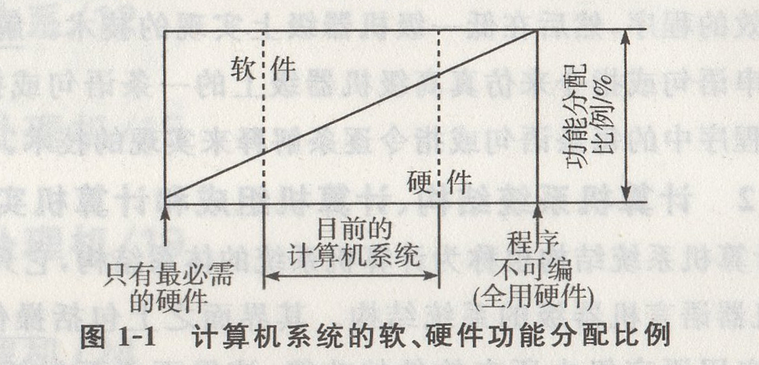

## 第1章 概论

### 1.1 计算机系统的层次结构

[单选、填空]从使用语言的角度,一台由软、硬件组成的通用计算机系统可以被看成是按功能划分的多层机器级组成的**层级结构**。层级结构由高到低依次为**应用语言机器级**、**高级语言机器级**、**汇编语言机器级**、**操作系统机器级**、**传统机器语言机器级**和**微程序机器级**。

[填空]所谓**固件**，是一种具有软件功能的硬件。例如,将软件固化在只读存储器这种大规模集成电路的硬、器件上,就是一种固件。

[填空]以软件为主实现的机器称为**虚拟机**，以区别于由硬件或固件实现的实际机器。虚拟机也不一定全由软件实现,有些操作也可用固件或硬件实现。

[单选、填空、简答]**翻译技术**是先用转换程序将高一级机器级上的程序整个地变换成低一级机器级上等效的程序，然后在低一级机器级上实现的技术。**解释技术**则是在低级
机器级上用它的一串语句或指令来仿真高级机器级上的一条语句或指令的功能，是通过对高级机器级语言程序中的每条语句或指令逐条解释来实现的技术。

### 1.2 计算机系统结构、计算机组成和计算机实现

[单选、填空]计算机系统结构也称为计算机系统的体系结构,它只是系统结构中的一部分,指的是传统机器语言机器级的系统结构。其界面之上包括**操作系统级**、**汇编语言级**、**高级语言级**和**应用语言级**中所有软件的功能，该界面之下包括所有硬件和固件的功能。

[简答]计算机系统结构的属性包括:

(1)硬件能直接识别和处理的数据类型及格式等的数据表示。

(2)最小可寻址单元、寻址种类、地址计算等的寻址方式。

(3)通用/专用寄存器的设置、数量、字长、使用约定等的寄存器组织。

(4)二进制或汇编指令的操作类型、格式、排序方式、控制机构等的指令系统。

(5)主存的最小编址单位、编址方式、容量、最大可编址空间等的存储系统组织。

(6)中断的分类与分级、中断处理程序功能及入口地址等的中断机构。

(7)系统机器级的管态和用户态的定义与切换。

(8)输入/输出设备的连接、使用方式、流量、操作结束、出错指示等的机器级I/O结构。

(9)系统各部分的信息保护方式和保护机构等属性。

[简答]计算机组成设计要确定的方面一般应包括: 

(1)数据通路宽度(数据总线一次并行传送的信息位数)。

(2)专用部件的设置(是否设置乘除法、浮点运算、字符处理、地址运算等专用部件、设置的数量与机器要达到的速度、价格及专用部件的使用频率等有关)。

(3)各种操作对部件的共享程度(分时共享使用程度高，虽然限制了速度,但价格更便宜。设置部件多降低共享程度,因操作并行度提高,可提高速度,但价格也会提高)。

(4)功能部件的并行度(是用顺序串行,还是用重叠、流水或分布式控制和处理)。

(5)控制机构的组成方式(用硬件还是微程序控制，是单机处理还是多机或功能分布处理)。

(6)缓冲和排队技术(部件间如何设置及设置多大容量的缓冲器来协调它们的速度差。是用随机先进先出、先进后出、优先级,还是用循环方式来安排事件处理的顺序)。

(7)预估、预判技术(用什么原则为优化性能预测未来行为)。

(8)可靠性技术(用何种冗余和容错技术来提高可靠性)。

### 1.3 计算机系统的软、硬件取舍及定量设计原理

[单选、填空]软件的功能可以用**硬件**或**固件**完成，硬件的功能也可以用软件模拟完成，只是它们在性能、价格、实现的难易程度上是不同的。具有相同功能的计算机系统,其软硬件功能分配比例可以在很宽的范围内变化，如图1-1所示.

[简答]软、硬件取舍的基本原则如下:

(1)应考虑在现有硬、器件(主要是逻辑器件和存储器件)条件下，系统要有高的性能价格比，主要从实现费用、速度和其他性能要求来综合考虑。)

(2)要考虑准备采用和可能采用的组成技术,使之尽可能不要过多或不合理地限制各种组成、实现技术的采用。

(3)不能仅从“硬”的角度考虑如何便于应用组成技术的成果和便于发挥器件技术的进展,还应从“软”的角度把如何为编译和操作系统的实现以及为高级语言程序的设计提供更多、更好的硬件支持放在首位。

[简答]Amdahl定律如下:

该定律可用于确定对系统中性能瓶颈部件采取措施提高速度后系统性能改进的程度，即系统加速比$S_p$。系统加速比$S_p$定义为系统改进后的性能与未改进时的性能的比值，或者定义为系统未改进时的程序执行时间$T_{old}$与改进后的程序执行时间$T_{new}$的比值。
系统加速比$S_p$与两个因素有关，即性能可改进比$f_{new}$和部件加速比$r_{new}$。

性能可改进比$f_{new}$是系统性能可改进部分占用的时间与未改进时系统总执行时间的比值,0≤$f_{new}$≤1。部件加速比$r_{new}$是系统性能可改进部分在改进后性能提高的比值，$r_{new}$>1。

系统加速比为$S_p=\frac{T_{old}}{T_{new}}=\frac{1}{(1-{f_{new}})+{f_{new}}/{r_{new}}}$

可见，当系统性能可改进比$f_{new}$为0时,$S_p$=1;而当部件加速比$r_{new}$趋向无穷大时，分母中$f_{new}$/$r_{new}$ 将趋于0,这里有

$S_p=\frac{1}{1-f_{new}}$

就是说,性能提高的幅度受限于性能改进部分所占的比例大小，而性能改善的极限又受到性能可改进比$f_{new}$的约束。

[简答、综合应用]如果系统中某部件处理速度提高到10倍，即$r_{new}$=10,但该功能的处理时间仅占整个系统运行时间的40%,则改进后，整个系统的性能加速比为

$S_p=\frac{1}{(1-0.4)+0.4/10}=\frac{1}{0.64}\approx1.56$

[填空]程序执行时,90%的时间只访问整个程序的10%那一部分，而其余10%的时间访向另外90%的那**部分程序**。

[单选、填空]从多级层次结构出发,计算机系统的设计按多级层次结构的由上、下、中开始设计可以有“**由上往下**”、“**由下往上**”、“**由中间开始**”3种不同的设计方法。

### 1.4 软件、应用、器件的发展对系统结构的影响

[单选.简答]实现软件移植的技术主要有如下几种:

(1)统一高级语言。

(2)采用系列机。

(3)模拟和仿真。

[单选、填空]如果要求原来在B机器上运行的应用软件，能移植到有不同系统结构的A机器上，根据层次结构的概念，可把B机器的机器语言看成是在A机器的机器语言级之上的一个**虚拟机器语言**，在A机器上用虚拟机概念来实现B机器的**指令系统**。B机器的每条机器指令用A机器的一段机器语言程序解释，如同A机器上也有B机器的指令系统一样。这种用机器语言程序解释实现软件移植的方法称为模拟。进行模拟的A机器称为**宿主机**,被模拟的B机器称为**虚拟机**。

[单选、填空]仿真和模拟的主要区别在于解释用的语言。仿真用的是微程序解释,其解释程序存储于控制**存储器**中;而模拟是用机器语言程序解释，其解释程序存储于**主存**中。

[填空]非用户片也称为通用片,其功能是由器件厂家生产时固定的，器件的用户只能使用，不能改变器件内部功能。

### 1.5 系统结构中的并行性开发及计算机系统的分类

[单选、简答]从计算机系统执行程序的角度来看，并行性等级由低到高可分为四级，

(1)**指令内部**————一条指令内部各个微操作之间的并行执行。

(2)**指令之间**————多条指令的并行执行。

(3)**任务或进程之间**————多个任务或程序段的并行执行。

(4)**作业或程序之间**————多个作业或多道程序的并行执行。

[简答]从计算机系统中处理数据的角度来看，并行性等级从低到高可分为四级，分

(1)位串字串————同时只对一个字的一位进行处理，这通常是指传统的串行单处理机,没有并行性。

(2)位并字串————同时对 一个字的全部位进行处理,这通常是指传统的并行单处理机,开始出现并行性。

(3)位片串字并————同时对许多字的同一位(称位片)进行处理,开始进入并行处理领域。

(4)全并行————同时对许多字的全部或部分位组进行处理。

[简答]并行性是贯穿于计算机信息加工的各个步骤和阶段的,从这个角度来看，并行性等级又可分为:

(1)存储器操作并行————可用单体单字 、多体单字或多体多字方式在一个存储周期内访问多个字,进而采用按内容访问方式在一个存储周期内用位片串字并或全并行方式实现对存储器中大量字的高速并行比较、检索、更新、变换等操作。典型的例子就是并行存储器系统和以相联存储器为核心构成的相联处理机。

(2)处理器操作步骤并行————指令的取指分析、执行,浮点加法的求阶差、对阶、尾加、舍入、规格化等操作，执行步骤在时间上重叠流水地进行。典型的例子是流水线处理机。

(3)处理器操作并行————通过重复设置大量处理单元，让它们在同一控制器控制下按同一指令要求对向量 、数组中各元索同时操作。典型的例子是阵列处理机。

(4)指令、任务 作业并行————这是较高级的并行。指令级以上的并行是多个处理机同时对多条指令和相关的多数据组进行处理，操作级并行是对同一条指令及其相关的数据组进行处理。前者属于多指令流多数据流计算机，后者属于单指令流多数据流计算机。典型的例子是多处理机。

[单选、填空]**时间重叠**是在并行性概念中引入时间因索,让多个处理过程在时间上相互错开,轮流重叠地使用同一套硬件设备的各个部分， 加快硬件周转来赢得速度。

[单选、填空]**资源重复**是在并行概念中引入空间因素，通过重复设置硬件资源来提高可靠性或性能。双工系统是通过使用两台相同的计算机完成同一任务来提高可靠性的。

[单选填空]**资源共享**是用软件方法让多个用户按一定时间顺序轮流使用同一套资源来提高资源利用率，相应地也就提高了系统的性能。

[单选、填空]一般用耦合度反映多机系统中各机器之间物理连接的紧密度和交叉作用能力的强弱,有**最低耦合**、**松散耦合**和**紧密耦合**之分。