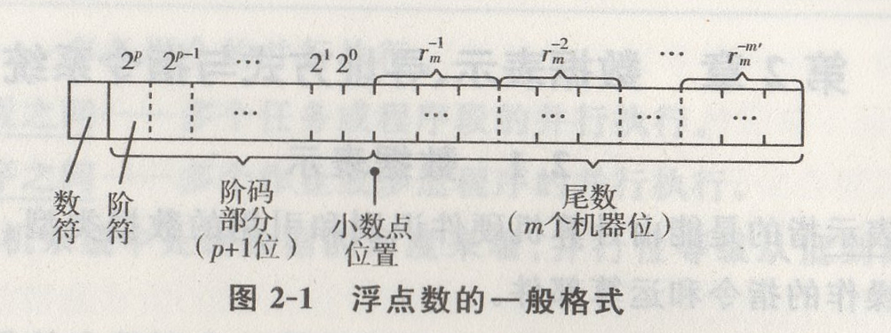
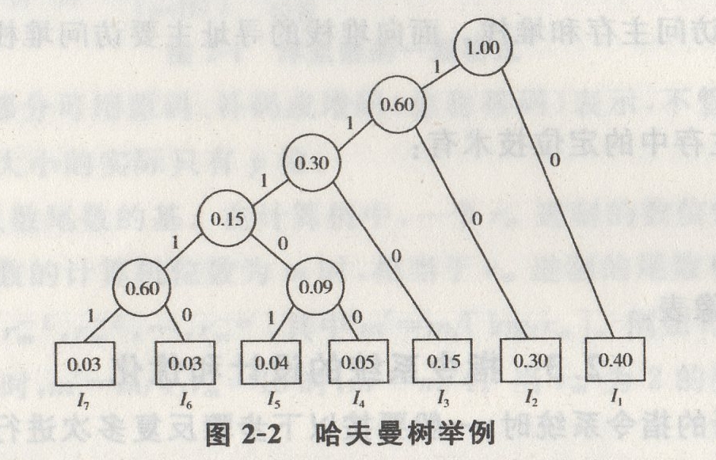

## 第二章 数据表示、寻址方式与指令系统

## 2.1 数据表示

[填空]**数据表示**指的是能由计算机硬件识别和引用的数据类型，表现在它有对这种类型的数据进行操作的指令和运算部件。

[填空]**数据结构**是要通过软件映像，变换成计算机中所具有的数据表示来实现的。不同的数据表示可为数据结构的实现提供不同的支持，表现为实现效率和方便性的不同。

[简答]高级数据表示的形式如下:

(1)自定义数据表示。自定义数据表示包括标识符数据表示和数据描述符两类。

(2)向量、数组数据表示。为向量、数组数据结构的实现和快速运算提供更好的硬件支持的方法是增设向量、数组数据表示,组成向量机。有向量数据表示的处理机就是向量处理机，如向量流水机阵列机、相联处理机等。

引入向量、数组数据表示不仅能加快形成元索地址，更重要的是便于实现把向量各元素成块预取到中央处理机，用一条向量、数组指令流水或同时对整个向量、数组高速处理。

(3)堆栈数据表示。堆栈数据结构在编译和子程序调用中很有用，为高效实现，不少计算机都设有堆栈数据表示。有堆栈数据表示的计算机称为堆栈计算机。

[简答]标志符数据表示的主要优点是:

(1)简化了指令系统和程序设计。由于指令通用于多种数据类型的处理，减少了指令系统中指令的种类，因此简化了程序设计。

(2)简化了编译程序。在一般计算机中，目的代码的形成需要进行细致的语义分析。

例如，当编译程序遇到“+”算子时，必须检查是哪种加法指令。而在带标志符的计算机中，编译程序只需形成通用的加法指令,编译程序缩短，编译过程加快，编译效率提高。

(3)便于实现一致性校验。可由计算机硬件直接快速检测出多种程序设计错误,提供了类型安全环境。

(4)能由硬件自动变换数据类型。如果操作数相容但长度不同时，硬件能自动转换，然后计算。

(5)支持数据库系统的实现与数据类型无关的要求，是程序不用修改即可处理多种不同类型的数据。

(6)为软件 调试和应用软件开发提供了 支持。由于可用软件定义的捕捉标志位设置了断点,因此便于程序的跟踪和调试。加上类型安全环境的提供，为应用软件开发提供了良好的支持。

[简答、综合应用]当计算机字长相同时,用浮点数表示实数比用定点数表示有更大的可表示数范围。不少计算机都采用类似图2-1所示的格式表示一个浮点数。

图2-1中的阶码部分可用原码、补码或增码(也称移码)表示，不管怎么表示,p+1位阶码部分中影响阶值大小的实际只有p位。

用$r_m$来表示浮点数尾数的基。在计算机中，一个$r_m$进制的数位是用$⌈log_2r_m⌉$个计算机位数来表示的。尾数的计算机位数为m时,相当于$r_m$进制的尾数有m'个位数,其位权由小数点向右依次为$r_m^{-1}$,$r_m^{-2}$,...,$r_m^{-m'}$其中$m'=m/\lceil log_2r_m \rceil$。例如$r_m=2$时,$m=m'$,$r_m=8$时,$m'=m/3$;$r_m=16$时,$m'=m/4$;$r_m=10$时,$m'=m/4$。当$r_m$为2的整数次幂时，就有特例:$r^{m'}_m=2$。

以$r_m$为尾数基值的浮点数是当其尾数右移一个$r_m$进制数位时，为保持数值不变，阶码才增1。

所谓规格化正尾数，就是正尾数小数点后的第1个$r_m$进制数位不是0的数。因为尾数为全“0”的数是机器零,不作为计算机中可表示的数。所以,最小正尾数值应当是$r_m$进制尾数的小数点后第1个$r_m$进制数位为“1”,其余数位为全“0”的数值，即$1\times r_m^{-1}$。最大正尾数值当然是$r_m$进制尾数各数位均为$r_m-1$。可以设想，在小数点后，$r_m$进制的第m'为$1-r_m^{-m'}$个数位上加上1,即加上$r_m^{-m'}$，就会使整个尾数值变为1。所以,可表示的最大尾数值应当为$1-r_m^{-m'}$。

由于是非负阶,最小阶应当是阶值部分为全“0”，所以，最小阶为0。最大阶应当是阶值部分$p$位为全“1”,所以，最大阶为$2^p-1$。阶的个数由阶值0到$2^p-1$,共有$2^p$个。

按浮点数表示格式的含义,浮点数的值应当是$r_m^{阶值}\times$尾数值。可表示浮点数的最小值应当是阶为非负阶的最小值0,尾数为规格化最小正尾数值,所以，可表示浮点数的最小值应当为$r_m^0\times r_m^{-1}=r_m^{-1}$;可表示浮点数的最大值应当是阶为正的最大值$2^p-1$,尾数为规格化正尾数最大值，所以，可表示浮点数的最大值应当为$r_m^{2^p-1}\times (1-r_M^{-m'})$。

可表示的浮点数规格化数的总个数应当是可表示阶的个数与可表示尾数的个数的乘积。由于尾数m'个$r_m$进制数位中，每个数值均可以为0~($r_m-1$),共有$r_m$个码，所以，尾数的编码总个数为$r_m^{m'}$个，但应当去掉小数点后第1个$r_m$进制数位是0的那些非规格化数。显然，非规格化尾数的个数占了全部尾数可编码总数的$1/r_m$的比例。所以，可表示的浮点数规格化数的总个数就为$2^p\times r_m^{m'}(1-1/r_m)$。

[简答]浮点数尾数的下溢处理方法有:

(1)截断法。

(2)舍入法。

(3)恒置“1”法。

(4)查表舍入法。

### 2.2 寻址方式

[单选填空]寻址方式指的是指令按什么方式寻找(或访问)到所需的操作数或信息的。多数计算机都将主存、寄存器、堆栈分类编址,分别有**面向主存**、**面向寄存器**和**面向堆栈**的寻址方式。面向主存的寻址主要访问主存,少量访问寄存器。面向寄存器的寻址主要访问寄存器,少量访问主存和堆栈。面向堆栈的寻址主要访问堆栈，少量的访问主存或寄存器。

[简答]程序在主存中的定位技术有:

(1)静态再定位。

(2)动态再定位。

(3)虚实地址映像表。

### 2.3 指令系统的设计和优化

[简答]在设计新的指令系统时，一般要按以下步骤反复多次进行,直至指令系统的效能达到很高为止。这些步骤依次为: 

(1)根据应用，初拟出指令的分类和具体的指令。

(2)试编出用该指令系统设计的各种高级语言的编译程序。

(3)对各种算法编写大量的测试程序并进行模拟测试，看指令系统的操作码和寻址方式效能是否都比较高。

(4)将程序中高频出现的指令串复合改成一条强功能新指令，即改用硬件方式实现;而将频度很低的指令的操作改成用基本的指令组成的指令串来完成,即用软件方式实现。

[综合应用]哈夫曼压缩概念的基本思想是，当各种事件发生的概率不均等时,采用优化技术，对发生概率最高的事件用最短的位数(时间)来表示(处理)，而对出现概率较低的事件允许用较长的位数(时间)来表示(处理)，就会使表示(处理)的平均位数(时间)缩短。

现假设某模型机共有n(n=7)条指令，使用频度如表2-1所示。若操作码用定长码来表示需要$\lceil log_2n \rceil$(即3)位。操作码的信息熵(信息源所含的平均信息量)H=2.17,说明表示这7种指令的操作码平均只需2.17位即可。现在用3位定长码表示，信息冗余为

$\frac{实际平均码长-H}{实际平均码长}=\frac{3-2.17}{3}\approx 28\%$

相当大，为减少冗余,改用哈夫曼编码。

指令|使用频度($p_i$)
--|--
$I_1$ | 0.40
$I_2$ | 0.30
$I_3$ | 0.15
$I_4$ | 0.05
$I_5$ | 0.04
$I_6$ | 0.03
$I_7$ | 0.03
_     | _

利用哈夫曼算法构造哈夫曼树。将所有7条指令的使用频度由小到大排序，每次选择其中最小的两个频度合并成一个频度,作为它们二者之和的新结点。再按该频度大小插到余下未参与结合的频度值中。如此继续进行,直到全部频度结合完毕形成根结点为止。之后,对每个结点向下延伸,分出两个分支，分别用一位代码的“0”或“1"来表示。这样,从根结点开始，沿线到达各频度指令所经过的代码序列就构成该频度指令的哈夫曼编码,如表22中的左部分所示。图2-2给出了此例的哈夫曼树。由于哈夫曼编码中的短码不可能是长码的前缀，从而保证了解码的唯一性和实时性。

表 2-2 操作码的哈夫曼编码及扩展操作码编码

指令|额度$p_i$|操作码OP使用哈夫曼编码|OP场地$l_i$|利用哈夫曼概念的拓展操作码|OP长度$l_i$
--|--|--|--|--|--
$I_1$ | 0.40 | 0         | 1 | 0 0     | 2
$I_2$ | 0.30 | 1 0       | 2 | 0 1     | 2
$I_3$ | 0.15 | 1 1 0     | 3 | 1 0     | 2
$I_4$ | 0.05 | 1 1 1 0 0 | 5 | 1 1 0 0 | 4
$I_5$ | 0.04 | 1 1 1 0 1 | 5 | 1 1 0 1 | 4
$I_6$ | 0.03 | 1 1 1 1 0 | 5 | 1 1 1 0 | 4
$I_7$ | 0.03 | 1 1 1 1 1 | 5 | 1 1 1 1 | 4

哈夫曼编码并不是唯一一的。当有多个相同的最小频度时,由于频度结合的次序不同，使树的形状不同，编码也不同。但只要采用完全的哈夫曼编码，操作码的平均码长肯定是唯一的，而且可用二进制位编码平均码长最短的编码。例如,本例中，操作码的平均码长$\overset{7}{\underset{i=1}{\sum}} p_il_i=2.20$位。这种编码的信息冗余是$\frac{2.20-2.17}{2.20}\approx 1.36\%$。

完全的哈夫曼编码是最优化的编码。但这种编码的码长种类太多，7种指令就有4种码长，不便于译码,因而不易实现。为此,结合用一般的二进制编码，可得到表2-2右部分的扩展操作码编码。

如表2-2那样，把使用频度高的$I_1$、$I_2$、$I_3$用两位操作码的00、.01.10表示，之后用高两位为11表示将操作码抄展成4位,其中低两位有4种状态可以分别表示$I_4$~$I_4$。这种表示法的平均长度$\overset{7}{\underset{i=1}{\sum}}p_il_i=2.30$位,信息冗余为5.65%，虽比哈夫曼编码的大，但比定长3位码的28%小得多,是一种实际可用的优化编码。

### 2.4 指令系统的发展和改进

[填空]面向目标程序的优化实现改进,就是对已有机器的指令系统进行分析,看哪些功能仍用**基本指令串**实现，哪些功能改用**新指令**实现，可以提高包括系统软件和应用软件在内的各种**机器语言目标程序**的实现效率。该方法既能减少目标程序占用的存储空间，减少程序执行中的访存次数,缩短指令的执行时间，提高程序的运行速度，又使实现更为容易。

**面向高级语言的优化**实现改进就是尽可能缩短高级语言和**机器语言**的**语义**差距，支持**高级语言编译**,缩短编译程序**长度**和**编译时间**。

[单选、简答]CISC存在如下问题:

(1)指令系统庞大，一般指令在200条以上。许多指令的功能异常复杂,需要有多种寻址方式、指令格式和指令长度。

(2)许多指令的操作繁杂，执行速度很低，甚至不如用几条简单、基本的指令组合实现。

(3)由于指令系统庞大，使高级语言编泽程序选择目标指令的范围太大,因此,难以优化生成高效机器语言程序，编译程序也太长,太复杂。

(4)由于指令系统庞大，各种指令的使用频度都不会太高，且差别很大,其中相当一部分指令的利用率很低。

[简答]采用RISC技术的好处主要有以下几个方面：

(1)简化指令系统设计,适合VLSI实现。由于指令条数少，寻址方式简单，指令格式规整划一，与CISC结构相比,控制器的译码和执行硬件相对简单。

(2)提高计算机的执行速度和效率。指令系统的精简可以加快指令的译码。控制器的简化可以缩短指令的执行延迟。访问次数的大大减少可以提高程序的执行速度。

(3)降低设计成本，提高系统的可靠性。采用相对精简的控制器,缩短了设计周期，减少了设计错误和产品设计中被作废的可能性，这些均会使设计成本降低，系统的可靠性提高。

(4)可直接支持高级语言的实现，简化编译程序的设计。指令总数的减少,缩小了编译过程中对功能类似的机器指令进行选择的范围,减轻了对各种寻址方式的选择、分析和变换的负担,不用进行指令格式的变换,易于更换或取消指令。