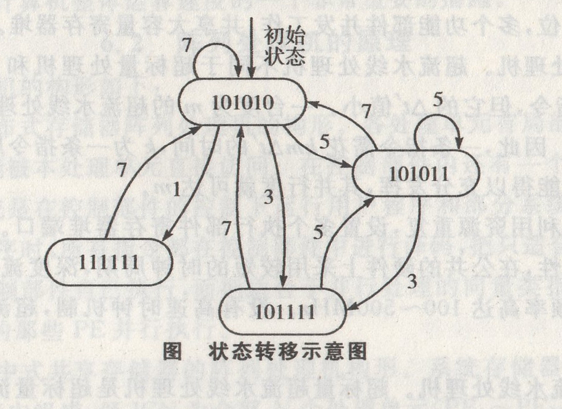

## 第5章 标量处理机

### 5.1 重叠方式

[单选、填空]**顺序解释**指的是各条指令之间顺序串行(执行完一条指令后才取下条指令)地进行,每条指令内部的各个微操作也顺序串行地进行。解释一条机器指令的微操作可归并成取指令、分析和执行三部分。取指是按指令计数器的内容访主存,取出该指令送到指令寄存器。

[单选填空]**指令的分析**是对指令的操作码进行译码，按寻址方式和地址字段形成操作数真地址，并用此真地址去取操作数(可能访主存,也可能访寄存器)，为取下一条指令还要形成下一条指令的地址。

[单选.填空]**指令的执行**则是对操作数进行运算、处理,或存储运算结果(可能要访主存)。

[简答]实现指令的重叠解释必须在计算机组成上满足以下几点要求:

(1)要解决访主存的冲突。

(2)要解决“分析”与“执行”操作的并行。

(3)要解决“分析”与“执行”操作控制上的同步。

(4)要解决指令间各种相关的处理。

[简答]“一次重叠”的定义和好处有:

任何时候都只是“执行$k$”与“分析$k+1$”重叠。就是说,即使“分析$k+1$”比“执行$k$”提前结束，“执行$k+1$”也不紧接在“分析$k+1$”之后与“执行$k$”重叠进行;同样，即使“执行$k+1$”比“分析$k+1$”提前结束，“分析$k+2$”也不紧接在“执行$k$”之后与“分析$k+1$”重叠进行。称这种指令分析部件和指令执行部件在任何时候都只有相邻的两条指令在重叠解释的方式为“一次重叠”。“一次重叠”的好处是节省硬件,计算机内指令分析部件和指令执行部件均只需一套，也简化了控制。设计时应适当安排好微操作，使“分析”和“执行”的时间尽量等长,重叠方式才能有较高的效率。

[填空]**指令相关**是因为机器指令允许修改而引出的。如果规定在程序运行过程中不准修改指令，指令相关就不可能发生。

### 5.2 流水方式

[简答]流水与重叠的含义如下:

流水与重叠在概念上没有什么差别，流水可以看成是重叠的引申。二者的差别只在于“一次重叠”是把一条指 令的解释分为两个子过程，而流水是分为更多个子过程。前者可同时解释两条指令;后者可同时解释4条指令。显然,如果能将一条指令解释分解为时间相等的$m$个子过程，则每隔$△t=T/m$就可以处理条指令。因此,流水的最大吞吐率取决于子过程的经过时间$△t$,$△t$越小，流水线的最大吞吐率就越高，流水的最大吞吐率是指流水线满负荷每隔$△t$流出一个结果时所达到的吞吐率。实际吞吐率总是低于其最大吞吐率。

[单选.填空]流水的分类如下:

(1)流水按处理的级别可分为部件级、处理机级和系统级。

(2)从流水具有功能的多少，可以分为单功能流水线和多功能流水线。

(3)按多功能流水线的各段能否允许同时用于多种不同功能连接流水,可把流水线分为静态流水线和动态流水线。

(4)从计算机所具有的数据表示角度,可以把流水线处理机分为标量流水机和向量流水机。

(5)从流水线中各功能段之间是否有反馈回路的角度，可以把流水线分为线性流水线和非线性流水线。

[简单应用]标量流水线的性能 与计算如下:

标量流水处理机的性能主要是吞吐率$T_p$、加速比$S_p$、和效率$\eta$。

吞吐率是流水线单位时间里能流出的任务数或结果数。由于各个子过程进行的工作不同,所经过的时间也就不一定相同，所以在 子过程间设置了接口锁存器,让各锁存器都受同一时钟同步。时钟周期会直接影响流水线的最大吞吐率，总希望它越小越好。如果各个子过程所需的时间分别为$△t1$、$△t2$、$△t3$、$△t4$,时钟周期应当为max{$△t1$、$△t2$、$△t3$、$△t4$},即流水线的最大吞吐率为:

$T_{p_{max}}=\frac{1}{max\{△t1、△t2、△t3、△t4\}}$

受限于流水线中最慢子过程经过的时间。流水线中经过时间最长的子过程称为瓶颈子过程。

[填空]流水线的效率是指流水线中设备的实际使用时间占整个运行时间之比，也称流水线设备的**时间利用率**。

[单选、填空]任务在流水线中流动顺序的安排和控制可以有 两种方式。一种是让任务(指令)流出流水线的顺序保持与流入流水线的顺序一致，称为顺序流动方式或**同步流动方式**;另一种是让流出流水线的任务(指令)顺序可以和流入流水线的顺序不同，称为**异步流动方式**。

[简答]标量流水机对局部性相关的处理一般采用总线式分布方式控制管理，包括:

(1)相关的判断主要是靠分布于各寄存器的“忙位”标志来管理。

(2)在分散于各流水线的入、出端设置若干保存站来缓存信息。

(3)用站号控制公共数据总线的连接作相关专用通路使之可为多个子过程的相关所共用。

(4)一旦发生相关，用更换站号来推后和控制相关专用通路的连接。

(5)采用多条流水线，每条流水线入端有多组保存站，以便发生相关后，可以采用异步的流动方式。

[简答]全局性相关指的是以进入流水线的转移指令(尤其是条件转移指令和其后续指令之间相关。下面介绍一些常用的处理方法:

(1)使用猜测法。

(2)加快和提前形成条件码。

(3)采取延迟转移。

(4)加快短循环程序的处理。

[综合应用]在一个4段的流水线处理机上需经7拍才能完成一个任务,其预约表如表5-1所示。

表 5-1 7拍才能完成一个任务的预约表

时间/段|1|2|3|4|5|6|7
--|--|--|--|--|--|--|--
$S_1$| √ |   |   |   | √ |   | √ |
$S_2$|   | √ |   | √ |   |   |   |
$S_3$|   |   | √ |   |   |   |   |
$S_4$|   |   |   | √ |   | √ |   |

分别写出延迟禁止表F、冲突向量C:画出流水线状态转移图:求出最小平均延迟及流水线的最大吞吐率及其调度时的最佳方案,按此调度方案，输入6个任务,求实际的吞吐率。

此例可得延迟禁止表$F=\{2,4,6\}$,初始冲突向量$C=(101010)$。 状态转移图和各种调度方案及其相应的平均延迟如下图和表5-2所示。

表 5-2 调度方案及其相应的平均延迟

调度方案|平均延迟/拍
--|--
(1,7)|4
(3,5)|4
(5,3)|4
(5)  |5

由表 5-2 可知，最小平均延迟为4拍。

此时流水线的最大吞吐率$T_{p_{max}}=1/4(任务/拍)$

最佳调度方案宜选其中按(1,7)周期性调度的方案。

按(1,7)调度方案输入6个任务，全部完成的时间为1+7+1+7+1+7=24(拍),实际吞吐率$T_{p_{max}}=6/24(任务/拍)$。

若按(3,5)调度方案输入6个任务,全部完成的时间为3+5+3+5+3+7=26(拍),实际吞吐率$T_{p_{max}}=6/26(任务/拍)$。

若按(5,3)调度方案输入6 个任务，全部完成的时间为5+3+5+3+5+7=28(拍),实际吞吐率$T_{p_{max}}=6/28(任务/拍)$。

可见，最佳的方案应为(1,7)调度方案，输入6个任务的实际乔吐率较其他方案要更高些。

### 5.3 指令级高度并行的超级处理机

[单选、简答]自20世80年代RISC兴起之后，出现了提高指令级并行的高性能超级处理机让单处理机在每个时钟周期里可解释多余指令。代表性的例子是超标量处理机、超长指令字处理机(VLIW)、超流水线处理机和超标量超流水线处理机。

(1)超标最处理机。超标量处理机采用多指令流水线，每个A同时流出m条指令(称为度$m$)。在超标量流水线处理机中配置多套功能部件、指令译码电路和多组总线，寄存器也备有多个多个端口和多组总线。

(2)超长指令字处理机。 超长指令字结构是将水平型微码和超标量处理两者相结合。指令字长可达数百位，多个功能部件并发工作，共享大容量寄存器堆。

(3)超流水线处理机。超流水线处理机不同于超标量处理机和VLIW处理机，每个
$\triangle t'$仍只流出一条指令,但它的$\triangle t'$值小。一台度为$m$的超流水线处理机的$\triangle t'$只是基本机器周期$\triangle t'$的$1/m$。因此，一条指令需花$km\triangle t'$的时间，$k$为一条指令所含的基本机器周期数。只要流水线性能得以充分发挥,其并行度就可达$m$。

超标量处理机利用资源重复，设置多个执行部件寄存带堆端口，超流水线处理机则着重开发时间并行性，在公共的硬件上采用较短的时钟周期，深度流水来提高速度，需使用多相时钟，时钟频率高达100~500MHz。没有高速时钟机制，超流水线处理机是无法实现的。

(4)超标量超流水线处理机。超标量超流水线处理机是超标量流水线与超流水线处理机的结合。
在一个$\triangle t'$(等于$\triangle t/n$)发射了$k$条指令(超标量)，而每次发射时间错开$\triangle t'$(超流水),相当于每拍$\triangle t$流出了$nk$条指令,即并行度$m=kn$。