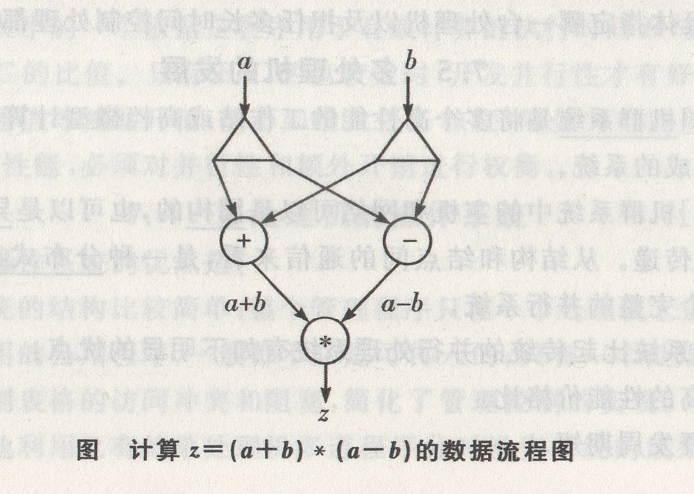

## 第8章 数据流计算机和归约机

### 8.1 数据流计算机

[单选、填空]数据驱动的**数据流方式**指的是,只要一条或一组指令所要求的操作数全部准备就绪，就可以立即激发相应的指令或指令组执行。执行结果的输出将送往等待这一数据的下一条或下一组指令。

[简答]控制流方式与数据流方式的比较如下:

控制驱动的控制流方式的特点是:通过访问共享存储单元让数据在指令之间传递;指令执行的顺序性隐含于控制流中,但却可以显式地使用专门的控制操作符来实现并行处理;指令执行的顺序受程序计数器控制，也就是受控制令牌所支配的。数据驱动的数据流方式则不同，它没有通常的共享变量的概念，即没有共享存储数据的概念;指令执行顺序只受指令中数据相关性的制约;数据是以数据令牌方式直接在指令之间传递的。

[填空]**数据流**是基于**异步性**和**函数性**的一种计算模型。

[填空]所谓**异步性**，是指一旦操作数到齐就开始操作，这是数据流计算机开拓并行性的基础。

[填空]所谓**函数性**,是指每一数据流操作都是消耗一组输入值,产生一组输出值而不发生副作用,具有变量出现在赋值语句左边仅一次的单赋值特性，从而保证任何两个并发操作可以按任意次序执行，而不会相互干扰。

[简答、综合应用]数据流程序可以看成是数据流机器语言。它有多个结点，并用一些弧把它们连接而成。每一个结点用圆圈或三角形或其他特殊符号表示，认为是一种处理部件。结点内的符号或字母表示一种操作,所以也称操作符。弧代表数据令牌在结点间的流向。在数据流计算机中，根据这些数据流程序图，通过一个分配器或分配程序,不断分配适当的处理部件来实现操作符的操作。下图表示了计算$z=(a+b)*(a-b)$的数据流程序图。

[单选、简答]为了满足数据流计算机程序设计的需要，还需进步引入许多 常用的其他结点。这些结点可分别表示如下:

(1)常数产生结点:没有输入端，只产生常数。激发后输出带常数的令牌。

(2)算逻运算操作结点:主要包括常用的+、-、*、/、乘方、开方等算术运算及非、与、或、异或或非等布尔逻辑运算。激发后输出带相应操作结果的令牌。

(3)复制操作结点:可以是数据的多个复制，也可以是控制量的多个复制。

(4)判定操作结点:对输入数据按某种关系进行判断和比较，激发后在输出控制端给出带逻辑值真(T)或假(F)的控制令牌。

(5)控制类操作结点:控制类操作结点的激发条件需要加到布尔控制端，可以把控制类操作结点细分为常用的4种:**T门控结点**、**F门控结点**、**开关门控结点**和**归并门控结点**。

[单选、简答]根据对数据令牌处理的方式不同，可以把数据流计算机的结构分成**静态**和**动态**两类。

(1)静态数据流计算机。 静态数据流计算机的数据令牌没加标号。为正确工作，任意给定时刻，当结点操作时，其任何一条输入弧上只能有一个数据令牌。只有当结点的所有输入弧上都有数据令牌时，该结点才被激活来执行相应的操作。由于数据令牌没有加标号,如果给定时间里允许一条弧上同时出现两个以上的数据令牌的话,结点对于送达各输入端的一批数据就无法区分出它们中哪些是属于同一批的操作数。因此，在静态数据流计算机中,为了满足迭代要求,除要多次重复激活同一操作结点外，还必须另设控制令牌，以识别数据令牌由一个结点传送到另一个结点的时间关系，从而区分属于不同迭代层次的各批数据,所以，静态数据流计算机不支持递归的并发激活，只支持一般的循环。

(2)动态数据流计算机。动态数据流计算机最主要的特点是让令牌带上标记,使得在任意给定时刻数据流程序图任何一条弧上允许出现多个带不同标记的令牌。令牌的标记是令牌附带的一个能识别该令牌时间先后相对关系的标号,有的计算机上也称其为颜色。所以,不需要像静态数据流计算机那样用控制令牌来对指令间数据令牌的传送加以认可。对于需要多组(次)数据令牌的指令，则是通过对令牌标记的配对来识别。为此，需要相应硬件将标记附加到数据令牌上,并完成对标记的匹配工作。

[简答]数据流计算机在提高并行处理效能上有着非常显著的特点，但也存在一些问题:

(1)数据流计算机的主要目的是为了提高操作级并行的开发水平，但如果题目本身数据相关性很强,内涵并行性成分不多时,就会使效率反而比传统的Von Neumann型机的还要低。

(2)在数据流计算机中为给数据建立、识别、处理标记,需要花费较多的辅助开销和较大的存储空间。但如果不用标记，则无法递归并会降低并行能力。

(3)数据流计算机不保存数组。

(4)数据流语言的变量代表数值，而不是存储单元位置,使程序员无法控制存储分配。

(5)数据流计算机互联网设计困难,输入/输出系统仍不够完善。

(6)数据流计算机没有程序计数器,给诊断和维护带来了困难。

### 8.28 归约机

[单选、填空]归约机和数据流计算机一样，都是基于**数据流**的计算模型，只是其采用的驱动方式不同。数据流计算机采用数据驱动，执行的操作序列取决于输入数据的可用性;归约机则是**需求驱动**，执行的操作序列取决于对数据的需求,对数据的需求又来源于**函数式程序设计语言**对表达式的归约。

[单选、简答]归约机的特点如下：

(1)归约机应当是面向函数式语言,或以函数式语言为机器语言的非Neumann型机器,其内部结构应不同于Neumann型机器。

(2)具有大容量物理存储器并采用大虚存容量的虚拟存储器,具有高效的动态存储分配和管理的软、硬件支持,满足归约机对动态存储分配及所需存储空间大的要求。

(3)处理部分应当是种有多个处理器或多个处理机并行的结构形式，以发挥函数式程序并行处理的特长。

(4)采用适合于函数式程序运行的多处理器(机)互连的结构，最好采用树形方式的互连结构或多层次复合的互连结构形式。

(5)为减少进程调度及进程间的通信开销,尽量把运行进程的结点机紧靠该进程所需用的数据安排,并使运行时需相互通信的进程所占用的处理机也靠近,让各处理机的负荷平衡。

[单选、简答]根据计算机所用归约方式的不同，相应就有串归约机和图归约机两类:

(1)串归约机可看成是一种特殊的符号串处理机,函数定义、表达式和目标都以字符串的形式存储于计算机中。函数式语言源程序可以不经翻译，直接在串归约机上进行处理。

(2)图归约机采取将函数定义、表达式和目标以图的形式存储于计算机中，图是其处理对象。最常用的图是二叉树和N叉树。