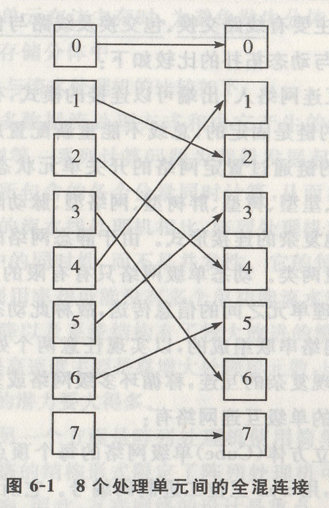
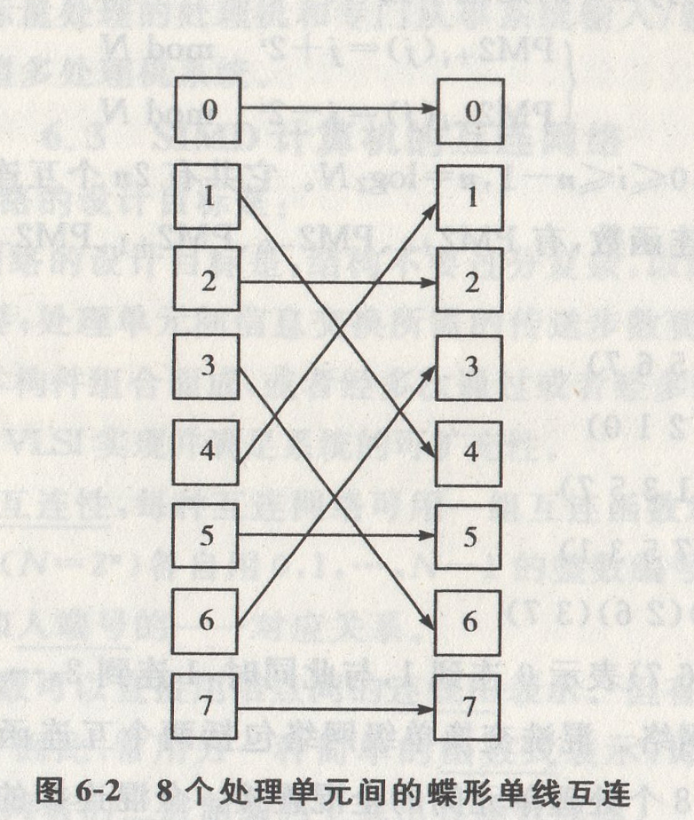

## 第6章 向量处理机

### 6.1 向量的流水处理与向量流水处理机

[单选填空]向量处理机是由向量数据表示的处理机，**分向量流水处理机**和**阵列处理机**两类。向量流水处理机是以时间重叠途径开发的，而阵列处理机是以资源重复途径开发的。

[综合应用]计算$D=A \times (B+C)$,其中A、B、C.D都有$n$个元素的向量，应该采用什么方式处理才能充分发挥流水线的效能？

如果采用逐个求D向量元素的方法，即访存取$a_i$、$b_i$、$c_i$元素求$d_i$,再取$a_{i+1}$、$b_{i+1}$、$c_{i+1}$求$d_{i+1}$,

这种处理方式称为横向(水平)处理方式。横向处理方式宜于在标量处理机上用循环实现,但却难以使流水线连续流动。尽管整个运算只需用一个单元$k$来存放中间结果,但会频繁出现先写后读的操作数相关,每次只有等加法结果出来才能开始乘法，因而流水的吞吐率会下降。这时只有采用对整个向量按相同操作都执行完之后再执行别的操作，才能较好地发挥流水处理的效能。也就是说，处理方式改为先执行$b_i + c_i \to k_i$ $(i=1,2,...,N)$，再执行$k_i \times a_i \to d_i(i=1,2,...,N)$，称这种方式为纵向(垂直)处理方式。在计算机B+C时，因为是对向量B、C的所有元素都执行相同的加法操作，且无相关,流水线就能连续流动,从而使其效能得以发挥。计算机$k \times A$时也是如此。

若向量的长度N太长,超出了向量寄存器组中寄存器的个数,可以将该向量分割成如若干组，使每组都能装得进向量寄存器组中。这样，每一组内均按纵向方式处理，而组和组之间则采用软件方法编制循环程序的方式依次循环处理。我们称这种处理方式为分组纵横处理方式。有了这种方式，就可以对向量长度N的大小不加限制。

[填空]所谓$V_i$冲突指的是并行工作的各向量指令的源向量或结果向量使用了相同的$V_i$。

[填空]CRAY-1向量处理的一个显著特点是只要不出现功能部件使用冲突和源向量寄存器使用冲突，通过链接机构可使有数据相关的向量指令仍能大部分时间并行执行。

**链接技术**是提高计算机整体运算速度的一个非常重要的措施。

### 6.2 阵列处理机的原理

[简答]阵列处理机的构形如下:

构形1是采用分布式存储器阵列处理机的构形。各处理单元有局部存储器(PEM)存放被分布的数据,只能被本处理单元直接访问。在控制部件内还有一个存放程序和数据的主存储器，整个系统是在控制部件的控制下运行用户程序和部分系统程序的。在执行主存储器中的用户程序时,所有指令都在控制部件中进行译码,把只适合串行处理的标量或控制类指令留给控制部件自己执行，而把适合于并行处理的向量类指令“播送”给各个PE,控制处于“活跃”的那些PE并行执行。

构形2是采用集中式共享存储器的阵列处理机构形。系统存储器是由K个存储分体$(MM_0\thicksim MM_{k-1})$集中组成,经ICN为全部N个处理单元$(PE_0\thicksim PE_{N-1})$所共享。为使各处理单元对长度为N的向量中各个元素都能同时并行处理,存储分体个数K应等于或多于处理单元数N。各处理单元在访主存时,为避免发生分体冲突，也要求有合适的算法能将数据合理地分配到各个存储分体中。

[单选、简答]阵列处理机与流水处理机的比较如下:

阵列处理机的单指令流多数据流处理方式和由它产生的特殊结构是以诸如有限差分、矩阵、信号处理线性规划等一系列计算问题为背景发展起来的。这些计算问题利用多个处理单元对向量或数组所包含的各个分量同时计算，从而易于获得很高的处理速度。

与同样擅长于向量处理的流水线处理机相比,阵列处理机利用的是资源重复，而不是时间重叠;利用的是并行性中的同时性,而不是并发性。它的每个处理单元要同等地担负起各种运算功能,但其设备利用率却可能没有多个单功能流水线部件的那样高。因此，只有在硬件价格有了大幅度下降以及系统结构有了较大改进的情况下,阵列处理机才能有好的性能价格比。阵列处理机提高速度主要是靠增大处理单元数，比起向量流水处理机主要靠缩短时钟周期来说，速度提高的潜力要大得多。

与流水线处理机不同的另一个方面是阵列处理机使用简单、规整的互连网络来确定处理单元间的连接。互联网络的结构形式限定了阵列处理机可用的解题算法，也会对系统多种性能指标产生显著影响,因此，互联网络的设计是重点。

阵列处理机在机间互连上比固定结构的单功能流水线灵活,使相当一部分专门问题上的工作性能比流水线处理机高得多，专用性强得多。

阵列处理机实质上是由专门应对数组运算的处理单元阵列组成的处理机、专门从事处理单元阵列的控制及标量处理的处理机和专门从事系统输入/输出及操作系统管理的处理机组成的一个异构型多处理机系统。

### 6.3 SIMD计算机的互连网络

[单选简答]互联网络的设计目标是:

SIMD系统的互联网络的设计目标是:结构不要过分复杂，以降低成本;互联要灵活，以满足算法和应用的需要;处理单元间信息交换所需的传送步数要尽可能少，以提高速度性能;能用规整单一的基本构件组合而成，或者经多次通过或者经多级连接来实现复杂的互联,使模块性好,以便于用VISI实现并满足系统的可扩充性。

[单选、填空]为反映互连性，每种互连网络可用一组互连函数定义。如果把互连网络的N个入端和N个出端$(N=2^n)$各自用0,1,...,N-1的整数编号代表，则互连函数就是表示互连网络的**出端号**和**入端号**的一一对应关系。

[单选填空]互连的数可以直接用结点间的**连线图**表示。但有时显得烦琐,也难以体现出连接上的内在规律。因此，常用另一种简单的函数式表示，即把所有入端$x$和出端$f(x)$都用二进制编码，从两者的二进制编码上找出其函数规律。

[单选填空]在确定PE之间通信的互联网络时需要对**操作方式**、**控制策略**、**交换方法**和**网络的拓扑结构**作出抉择。

[单选填空]操作方式有同步、异步及同步与异步组合3种。现有的列阵处理机根据其SIMD性质,均采用**同步操作方式**，让所有PE按时钟同步操作。异步或组合操作方式一般多用于多处理机。

[单选填空]交换方法主要有**线路交换**、**包交换**及**线路与包交换组合**3种。

[单选、简答]静态拓扑与动态拓扑的比较如下:

网络的拓扑结构是指互连网络入、出端可以连接的模式，有静态和动态两种。在静态拓扑结构中,两个PE之间的链是固定的，总线不能重新配置成与其他PE相连。而动态拓扑结构中，两个PE之间的链通过置定网络的开关单元状态可以重新配置。静态拓扑有一维的线型，二维的环型、星型树型胖树型网络型、脉动阵列型，三维的弦环型、立方体型、环立方体型,以及其他复杂的连接形式。由于静态网络的灵活性、适应性差,很少使用。动态网络有单级和多级两类。动态单级网络只有有限的几种连接,必须经循环多次通过，才能实现任意两个处理单元之间的信息传送,故称此动态单级网络为循环网络。动态多级网络是由多个单级网络串联组成的，以实现任意两个处理单元之间的连接。将多级互连网络循环使用，可实现复杂的互连，称循环多级网络或多级循环网络。

[简答综合应用]基本的单级互连网络有:

(1)立方体单级网络。立方体(Cube)单级网络的每个顶点(网络的结点)代表一个处理单元，共有8个处理单元，用$zyx$三位二进制码编号。它所能实现的入、出端连接如同立方体各顶点间能实现的互连一样，即每个处理单元只能直接连到其二进制编码的某一位取反的其他3个处理单元上。

(2)PM2I单级网络。PM2I单级网络是“加减$2^i$”单级网络的简称。能实现与$j$号处理单元直接相连的是号为$j2±^i$的处理单元,即

$\begin{cases} PM2_{+i}(j)=j+2^i mod N \\ PM2_{-i}(j)=j-2^i mod N \end{cases} $

式中，$0\leq j \leq N-1$,$0 \leq i \leq n-1$,$n=log_2N$。它共有2n个互连函数。对于N=8的三维PM2I互连网络的互连函数，有$PM2_{+0}$、$PM2_{-0}$、$PM2_{+1}$、$PM2_{-1}$、$PM2_{±2}$等五个不同的互连函数,它们分别为

$PM2_{+0}$：(0 1 2 3 4 5 6 7)

$PM2_{-0}$：(7 6 5 4 3 2 1 0)

$PM2_{+1}$：(0 2 4 6)(1 3 5 7)

$PM2_{-1}$：(6 4 2 0)(7 5 3 1)

$PM2_{±2}$：(0 4)(1 5)(2 6)(3 7)

其中,(0 1 2 3 4 5 6 7)表示0连到1,与此同时,1连到2,...,7连到0。

(3)混洗交换单级网络。混洗交换单级网络包括两个互连函数，一个是全混，另一个是交换。图6-1所示为8个处理单元间的全混连接。全混连接的规律是把全部按编码顺序排列的处理单元从当中分为数目相等的两半，前一半和后一半在连接至出端时正好一一隔开。

(4)蝶形单级网络的互连函数。蝶形单级网络的互连函数为

$Butterfly(P_{n-1}P_{n-2}...P_1P_0)=P_0P_{n-2}...P_1P_{n-1}$

即将二进制地址的最高位和最低位相互交换位置。图6-2所示为N=8个处理单元之间用蝶形单级互连网络互连的情况。它实现的是$0→0$,$1→4$,$2→2$,$3→6$,$4→1$,$5→5$,$6→3$,$7→7$的同时连接。

[单选、填空]N=8的多级PM2I网络的结构包含$n$级单元间连接，每一级都是把前后两列各$N=2^n$个单元按**PM2I**拓扑相互连接起来。从第$i$级$(0≤i≤n-1)$来说，每一个入单元$j(0≤j≤N-1)$都有3根连接线分别通往单元$j$、$j+2^imodN$和$j-2^imodN$。

[单选、填空]基准网络与二进制立方体网络的逆网络相似，只是在第1级的级间连接不同。它采取从输入到输出的级间互连为**恒等**、**逆全混**、**子逆全混**和**恒等置换**，所用交换单元均为二功能的,采取单元控制。

### 6.4 共享主存构形的阵列处理机中并行存储器的无冲突访问

[简单应用]实现方阵或长方阵数组的无冲突访问的要求:

对于二维数组(结论也适用于多维数组)而言，假设主存有$m$个分体并行,从中访问有$n$个元素的数组子集。这$n$个元素的变址跳距对于二维数组的行、列、主对角线、次对角线都是不一样的,但要求都能实现无冲突访问。

如果设$m=n=4$,一个4X4的二维数组直接按行存储的方案如图6-3所示。虽然同时访问某一行、主对角线或次对角线上的所有元索时，都可以无冲突地访问，但要同时访问某一列的元素时，由于它们集中存放在同一存储分体内，会产生访存冲突，因此，每次只能访问其中的一个元素,使实际频宽降低到1/4.

存储体体号

0|1|2|3
--|--|--|--
$a_{00}$|$a_{01}$|$a_{02}$|$a_{03}$
$a_{10}$|$a_{11}$|$a_{12}$|$a_{13}$
$a_{20}$|$a_{21}$|$a_{22}$|$a_{23}$
$a_{30}$|$a_{31}$|$a_{32}$|$a_{33}$

图 6-3 4X4数组的直接按行存储（m=n=4）

[简单应用]并行存储器中数组大小不固定的无冲突访问的要求是:有$n$个处理单元的并行处理机，为了能并行访问$n$个元素，且适应任意规模的数组,可以先将多维数组或者非$n \times n$方阵的二维数组按行或列的顺序变换为一维数组，形成一个一维线性地址空间，地址用$a$表示。然后,将地址$a$所对应的元素存放在体号地址$j=amodm$,体内地址为$⌊a/n⌋$的单元中,就可以满足无冲突访问的要求。

### 6.5 脉动阵列流水处理机

[单选、填空]脉动阵列结构是由一组处理**单元(PE)**构成的阵列。每个PE的内部结构相同，一般由一个加法/逻辑运算部件或加法/乘法运算部件再加上若干**锁存器**构成,可完成少数基本的算术逻辑运算操作。阵列内所有处理单元的数据锁存器都受同一个时钟控制。运算时数据在阵列结构的各个处理单元间沿各自的方向同步向前推进,形象的称其为**脉动阵列结构**。

[简答]脉动阵列结构具有如下一些特点:

(1)结构简单、规整,模块化强，可打充性好,非常适合用超大规模集成电路实现。

(2)PE间数据通信距离短、规则,使数据流和控制流的设计、同步控制等均简单规整。

(3)脉动阵列中所有PE能同时运算，具有极高的计算并行性，可通过流水获得很高的运算效率和吞吐率。输入数据能被多个处理单元重复使用，大大减轻了阵列与外界的I/O通信量,降低了对系统主存和1/O系统频宽的要求。

(4)脉动阵列结构的构形与特定计算任务和算法密切相关，具有某种专用性，限制了应用范围,这对VLSI是不利的。

[简答]造成脉动阵列处理机应用范围有限的关键因素是,受阵列结构的通用性及I/O带宽约束所限制的阵列结构的规模大小。发展通用脉动阵列结构的途径主要有3种:

(1)通过增设附加的硬件,对阵列的拓扑结构和互连方式用可编程开关进行重构，即经程序重新配置阵列的结构。

(2)用软件把不同的算法映像到固定的阵列结构上。该方法依赖于面向并行运算所采用的程序语言、操作系统、编译程序和软件开发工具的设计。

(3)探寻与问题大小无关的脉动处理方法，以及VLSI运算系统的分割矩阵算法，使它们可以克服阵列只能求解固定大小题目的缺陷，同时探寻发展适合一类计算问题的通用算法和相应的设置方案。