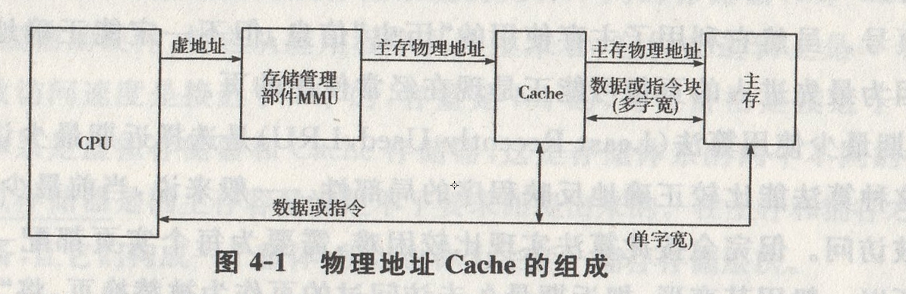
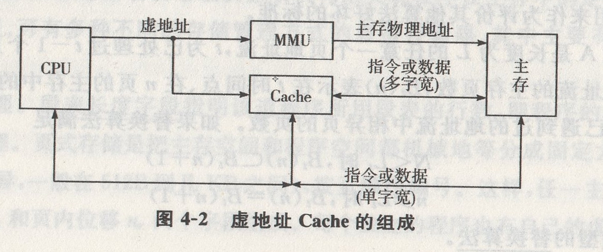

## 第4章 存储体系

### 4.1 基本概念

[简答]存储体系的含义如下:

存储体系(即存储层次)是让构成存储系统的几种不同的存储器($M_1$~$M_n$,)之间，配上输助软、硬件或辅助硬件，使之从应用程序员角度来看，它们在逻辑上是一个整体。让存储层次的等效访问速度是接近于$M_1$的，容量是$M_n$的，每位价格是接近于$M_n$。的。基本的二级存储体系是虚拟存储器和Cache存储器,这是存储体系的两个不同的分支。

[填空]**虚拟存储器**是因主存容量满足不了要求而提出来的。在主存和辅存之间，增设辅助的软硬件设备，让它们构成一个整体所以也称为主存一辅存存储层次。

[单选、填空]因主存速度满足不了要求而引出了Cache存储器。在CPU和主存之间增设高速、小容量每位价格较高的Cache,用铺助硬件将Cache和主存构成整体，称为**Cache存储器**(或称为Cache主存存储层次)。

### 4.2 虚拟存储器

[简答]虚拟存储器通过增设地址映像表机构来实现程序在主存中的定位。根据存储映像算法的不同，可有多种不同的存储管理方式的虚拟存储器.其中主要有段式、页式和段页式3种:

(1)段式管理。 **段表长度字段**指明该道程序所用段表的行数，即程序的段数。

(2)页式管理。 页式存储是把主存空间和程序空间都机械地等分成固定大小的页(页面大小随计算机而异，一般在512B到几KB之间)，按页顺序编号。这样,任一主存单元的地址$n_p$就有实页号$n_{\mu}$。和页内位移$n_{r}$两个字段组成。每个独立的程序也有自己的虚页号顺序。

(3)段页式管理。段页式存储是把实(主)存机械地等分成固定大小的页,程序按模块分段,每个段又分成与实主存页面大小相同的页。每道程序通过一个段表和相应的一组页表进行定位。段表中的每一行对应一个段。其中，“ 装入位”表示该段是否已装入主存。

在虚拟存储器中，每访问-次主存都要进行一次程序地址向实(主)存地址的转换。段页式的主要问题是地址变换过程至少需要查表两次,即查段表和页表。

[简答]提高页表的空间利用率的方法有:

整个多用户虚存空间可对应$2^{\mu}$个用户(程序),但主存最多同时只对其中N个用户(N道程序)开放。由于$N\times {2^{N'}}_v \geq {2^{N'}}_v$中使得页表绝大部分行中的实页号n。字段及其他字段都无用,这会大大降低页表的空间利用率。

一种解决办法是将页表中装入位为“0”的行用实页号$n_v$。字段存放该程序此虚页在辅存中的实地址，以便调页时实现用户虚页号到辅存实地址的变换。另一种方法是把页表压缩成只存放在已装入主存的那些虚页与实页位置($n_v$)的对应关系，该表最多为${2^{N'}}_v$行。我们称它为相联目录表法,简称目录表法。该表采用按内容访问的相联存储器构成。

[简答]替换算法的确定主要看主存是否有高的命中率，也要看算法是否便于实现，辅助软、硬件成本是否低。目前已研究过多种替换算法,如随机算法、先进先出算法、近期最少使用(近期最久未用过)算法等:

(1)先进先出算法(First-In First-Out, FIFO)是选择最早装入主存的页作为被替换的页。这种方法实现方便,只要在操作系统为主存管理所设的主存页面表中给每个实页配一个计数器字段。当每一页装入主存时，让该页的计数器清零,其他已装入主存的那些页的计数器都加“1”。需要替换时,计数器值最大的页的页号就是最先进入主存而现在准备替换掉的页号。虽然它利用了主存使用的“历史”信息，但不一定能正确地反映出程序的局部性。因为最先进入的页很可能正是现在经常使用的页。

(2)近期最少使用算法(Least Recently Used,LRU)是选择近期最少访问的页作为被替换页。这种算法能比较正确地反映程序的局部性。一般来说，当前最少使用的页，未来也将很少被访问。但完全按此算法实现比较困难，需要为每个实页都配一个字长很长的计数器。所以一般用其变形,把近期最久未访问过的页作为被替换页，将“多”和“少”变成“有”和“无" ,实现就方便多了。

(3)根据未来实际使用情况将未来的近期里不用的页替换出去，一定会有最高的主存命中率，这种算法称为优化替换算法(Optimal,OPT)。它是在时刻$t$找出主存中每个页将要用到的时刻$t_i$，然后选择其中$t_i+t$最大的那一页作为替换页。 优化算法是一种理想算法,可以被用来作为评价其他算法好坏的标准。

[填空]设A是长度为L的任意一个页地址流,$t$为已处理过$t-1$个页面的时间点,$n$为分配给亥地址流的主存页数，$B_t(n)$表示在$t$时间点、在$n$页的主存中的页面集合，$L_t$表示到$t$时间点已遇到过的地址流中相异页的页数。如果替换算法满足

$N \lt L_t$时,$B_t(n) \sub B_t(n+1)$

$n \geq L_t$,时,$B_t(n) = B_t(n+1)$

则属堆栈型的**替换算法**。

[填空]根据各道程序运行中的主存页面失效率低于某个值时，就自动增加分配给该道程序的主存页数，以提高其命中率;而当主存页面失效率低于某个值时，就自动减少分配给该道程序的主存页数，以便释放出这部分主存页面位置供其他程序用，从而使整个系统总的主存命中率和主存利用率得到提高。我们称此算法为**页面失效频率(PFF)算法**。

### 4.38 高速缓冲存储器

[填空]高速缓冲(Cache)存储器是为弥补主存速度的不足，在处理机和主存之间设置一个高速、小容量的Cache,构成Cache——主存存储层次，使之从CPU角度来看,速度接近于Cache,容量却是主存的。

[填空]对Cache存储器而言,**地址的映像**就是将每个主存块按某种规则装入Cache中;地址的变换就是每次访Cache时怎样将主存地址变换成Cache地址。

[简答]提高 Cache存储器的预取算法为:

Cache所用的取算法基本上是按需取进法,即在Cache失效时才将要访问的字所在的块取进。适当选择好Cache的容量、块的大小、组相连的组数和组内块数，是可以保证有较高的命中率的。如再采用在信息块要用之前就预取进Cache的预取算法，还可能进一步提高命中率。

### 4.4 三级存储体系

[简答]目前，多数的计算机系统既有虚拟存储器又有Cache存储器。程序用虚地址访存,要求速度接近于Cache ,容量是辅存的。这种三级存储体系可以有3种形式。

(1)物理地址Cache。物理地址Cache是由“Cache——主存”和“主存——辅存”两个独立的存储层次组成,图4-1就是这种形式。

CPU用程序虚地址访存,经存储管理部件(MMU)中的地址变换部件变换成主存物理地址访Cache.如果命中Cache,就访Cache;如果不命中Cache,就将该主存物理地址的字和含该字的主存的一个块与Cache某相应块交换，而所访问的字直接与CPU交换。

(2)虚地址Cache。虚地址Cache是将Cache——主存——辅存直接构成三级存储层次形式，其组成形式如图4-2所示。

CPU访存时，直接将虚地址送存储管理部件MMU和Cache。如果Cache命中，数据与指令就直接与CPU传送，如果Cache不命中，由存储管理部件将虚地址变换成主存物理地址访主存,将含该地址的数据块或指令块与Cache交换的同时,将单个指令和数据与CPU之间传送。

(3)全Cache。全Cache是最近出现的组织形式，尚不成熟，尚未商品化。它没有主存，只用Cache与辅存中的一部分构成“Cache辅存 ”存储体系。全Cache 存储系统的等效访问时间要接近于Cache的,容量是虚拟地址空间的容量。

